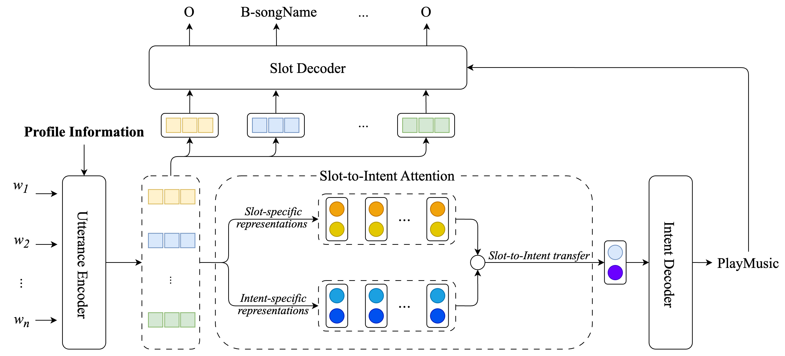

# JPIS: A Joint Model for Profile-Based Intent Detection and Slot Filling with Slot-to-Intent Attention

We propose a joint model, namely JPIS, designed to enhance profile-based intent detection and slot filling. JPIS incorporates the supporting profile information into its encoder and introduces a slot-to-intent attention mechanism to transfer slot information representations to intent detection. Experimental results show that our JPIS substantially outperforms previous profile-based models, establishing a new state-of-the-art performance in overall accuracy on the Chinese benchmark dataset ProSLU.

<p align="center">	

</p>

**Please CITE** [our paper](https://arxiv.org/abs/2312.08737) whenever our JPIS implementation is used to help produce published results or incorporated into other software.

    @inproceedings{JPIS,
    title     = {{JPIS: A Joint Model for Profile-based Intent Detection and Slot Filling with Slot-to-Intent Attention}},
    author    = {Thinh Pham and Dat Quoc Nguyen},
    booktitle = {Proceedings of the 2024 IEEE International Conference on Acoustics, Speech and Signal Processing (ICASSP)},
    year      = {2024}
    }


## Model installation, training and evaluation

### Installation
- Python version >= 3.8
- PyTorch version >= 1.7.1

```
    git clone https://github.com/VinAIResearch/JPIS.git
    cd JPIS/
    pip3 install -r requirements.txt
```

### Training and evaluation

To train the model, you can run the experiments by the following command:

```
python train.py \
        --gpu \
        --early_stop \
        --save_dir model_dir \
        --use_crf \
        --num_epoch 50 \
        --s2i \
        --i2s \
        --up \
        --ca \
        --use_pretrained \
        --model_type RoBERTa
```

If you have any questions, please issue the project or email me (v.thinhphp1@vinai.io or thinhphp.nlp@gmail.com) and we will reply soon.

### Acknowledgement

Our code is based on the implementation of the ProSLU paper from https://github.com/LooperXX/ProSLU
